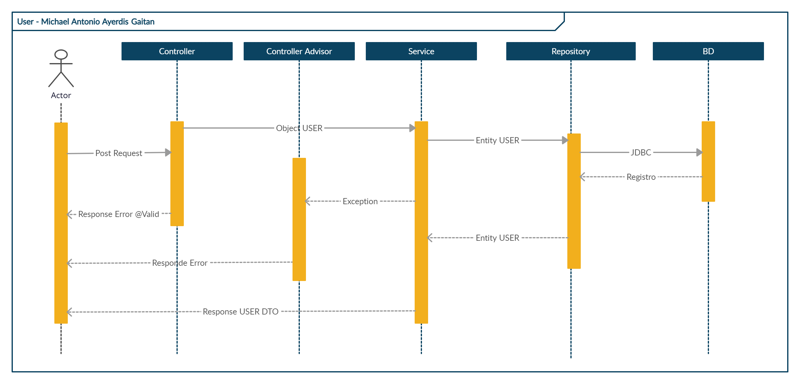

# User-API
Api de Creación usuarios
# Tecnologias
* **Spring boot:** Es una herramienta que facilita la contruccion de aplicaciones basada en Spring Framework y
  otras librerias de terceros como Tomcat, Hibernate y mas con sus dependencias iniciales, necesitando unicamente
  configuracion basica, entre ellas las siguientes:
    * Spring Web
    * Spring JPA
    * Spring Validation
* **Swagger:** Es una herramienta para documentar los API a exponer y presentarla de una menera rapida y eficaz.
* **JWT (Java Web Token)** Es una de las herramientas para la generación y verificación de Token json en Java.
* **Passay:** Es una herramienta para especificar politicas de validación y verficación de contraseñas
* **H2:** Es un motor de bases de datos embebido en el ORM Hibernate, asi mismo como en modo Cliente-Servidor.
# H2 DATABASE

[Abrir Consola](http://localhost:30000/h2-console/login.jsp)

|DB Name | DB User | DB Password |
|--------|---------|-------------|
| test   | sa      | sa          |
# Endpoints
* Compilación del proyecto
```shell
./gradlew bootRun
```

* Coleccion de Endpoints POSTMAN


En el Siguiente enlace pueden acceder a la coleccion con la cual se puden probar los endpoints con los datos de prueba precargados,

[Abrir en POSTMAN](https://www.postman.com/red-shadow-456208/workspace/public-workspace/collection/12671277-291ceaac-f59b-4e22-a813-ea9c1a2d61be)


# Swagger Documentación

En el siguiente enlace podran acceder a la documentacion generada por la libreria Swagger.

[Explorar Documentación](http://localhost:30000/swagger-ui/index.html)

# Diagrama de Flujo
